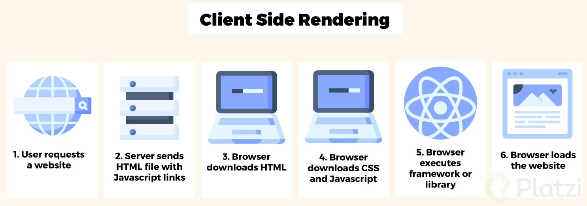
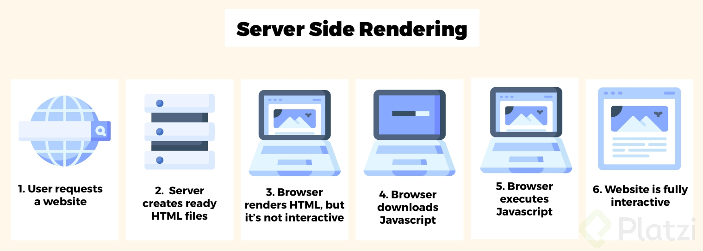
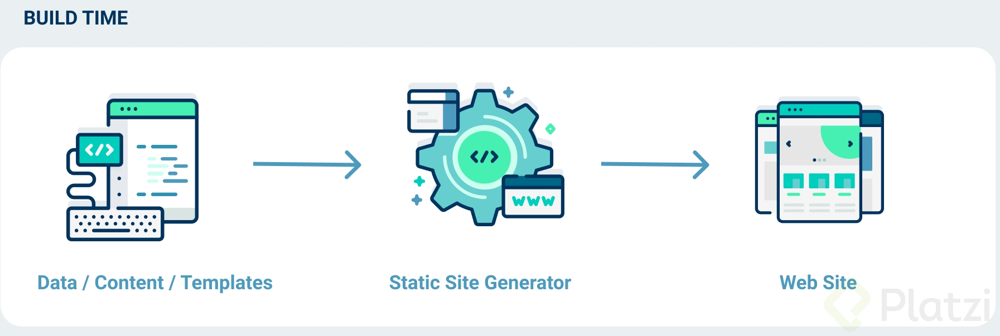

# Next.js: Sitios Estáticos y Jamstack

## Rendering

[Single Page Applications vs. Server Side Rendering vs. Generadores de Sitios Estáticos](https://platzi.com/blog/spa-vs-ssr-vs-static-site-generators/)

**_Procesar pedazos de código y datos para mostrar su resultado_**

### Modos de rendering

- Client-side
- Server-side
- Static rendering

#### Client-side

Todo el trabajo se hace bajo demanda del navegador. Por ejemplo, cada vez que agregemos JavaScript usando la etiqueta src, lo ejecutara el navegador y con **create-react-app** utiliza le client-side.

  

#### Server-side

Este tipo de rendering tenemos un servidor que se encraga de procesar los archivos para transformarlo en **html** y al final enviar este al navegador. Este tippo de rendering sucede bajo demanda en el servidor, la gran mayoría de lenguahes y frameworks backend (Symfony, Wordpress, Flask, Django).

  

#### Static generation rendering

El html se construye en el momento del **_build_** time, este tipo de rendering sucede una unica vez en **_build time_** (Jekyll, Wintersmith, Gatsby, Hugo, Next.js).

  
